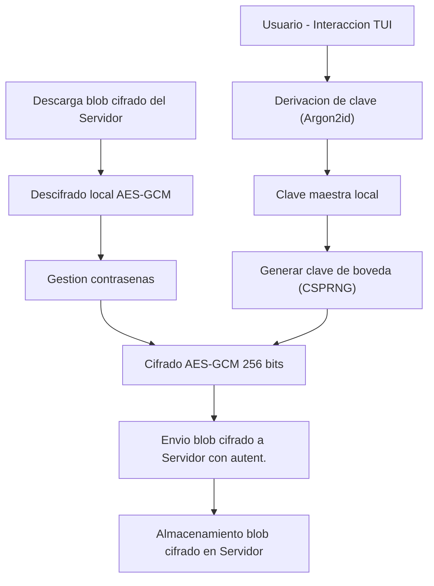

```mermaid
graph TD
    A["Usuario - Interaccion TUI"] --> B["Derivacion de clave (Argon2id)"]
    B --> C["Clave maestra local"]
    C --> D["Generar clave de boveda (CSPRNG)"]
    E["Gestion contrasenas"] --> F["Cifrado AES-GCM 256 bits"]
    D --> F
    F --> G["Envio blob cifrado a Servidor con autent."]
    G --> H["Almacenamiento blob cifrado en Servidor"]
    I["Descarga blob cifrado del Servidor"] --> J["Descifrado local AES-GCM"]
    J --> E
```