# Password Manager - Cryptographic Architecture

## Overview Diagram

```mermaid
flowchart TD
    subgraph "🌱 Recovery Seed Setup (First Time Only)"
        SEED1["🎲 Generate Pepper<br/>(CSPRNG, 32 bytes)"]
        SEED2["📝 Convert to 32-Word<br/>Seed Phrase"]
        SEED3["💾 Save to<br/>~/.proton_vault/pepper.key"]
        SEED4["👤 User Saves<br/>Seed Phrase Securely"]
        
        SEED1 --> SEED2
        SEED2 --> SEED3
        SEED2 --> SEED4
    end

    subgraph "Key Derivation (Every Encrypt/Decrypt)"
        A["👤 Master Password"]
        B["🧂 Salt<br/>(16 bytes, from blob or new)"]
        C["🌶️ Pepper<br/>(32 bytes, from local file)"]
        D["⚙️ Argon2id<br/>(64MB, 3 iter, 4 threads)"]
        E["🔑 Master Key<br/>(256-bit)"]
        
        A --> D
        B --> D
        C --> D
        D --> E
    end

    subgraph "�️ Vault Key Layer"
        VK1["🎲 Generate Vault Key<br/>(CSPRNG, new user)"]
        VK2["🔓 Decrypt Vault Key<br/>(existing user)"]
        VK3["🔐 Vault Key<br/>(256-bit AES key)"]
        VK4["🔒 Encrypt Vault Key<br/>(AES-GCM)"]
        VK5["📦 Encrypted Vault Key"]
        
        E --> VK2
        VK1 --> VK3
        VK2 --> VK3
        E --> VK4
        VK3 --> VK4
        VK4 --> VK5
    end

    subgraph "� Vault Data Layer"
        V1["📋 Vault JSON<br/>(passwords, notes, etc.)"]
        V2["🔒 Encrypt Vault<br/>(AES-GCM-256)"]
        V3["🔓 Decrypt Vault<br/>(AES-GCM-256)"]
        V4["� Encrypted Vault Data"]
        
        VK3 --> V2
        VK3 --> V3
        V1 --> V2
        V2 --> V4
        V4 --> V3
        V3 --> V1
    end

    subgraph "📦 Encrypted Blob Structure"
        BLOB["🗃️ EncryptedBlob<br/>├─ salt<br/>├─ encrypted_vault_key<br/>├─ vault_key_iv + tag<br/>├─ ciphertext (vault)<br/>└─ vault_iv + tag"]
        
        B -.->|stored in| BLOB
        VK5 --> BLOB
        V4 --> BLOB
    end

    subgraph "☁️ Server (Zero-Knowledge)"
        SRV1["📤 Upload Blob<br/>(with JWT auth)"]
        SRV2["💾 SQLite<br/>(stores blob only)"]
        SRV3["📥 Download Blob"]
        
        BLOB --> SRV1
        SRV1 --> SRV2
        SRV2 --> SRV3
        SRV3 --> BLOB
    end

    subgraph "💾 Local Backup"
        BK1["📁 Save Backup<br/>(~/.proton_vault/backups/)"]
        BK2["📄 username_timestamp.backup"]
        BK3["🔄 Restore from Backup"]
        
        BLOB --> BK1
        BK1 --> BK2
        BK2 --> BK3
        BK3 --> BLOB
    end

    subgraph "🔄 Modification Flow (Forward Secrecy)"
        MOD1["✏️ User Edits Vault"]
        MOD2["🎲 Generate NEW Salt"]
        MOD3["♻️ Re-derive Master Key"]
        MOD4["🔒 Re-encrypt Everything"]
        
        V1 --> MOD1
        MOD1 --> MOD2
        MOD2 --> MOD3
        MOD3 --> MOD4
        MOD4 --> BLOB
    end

    %% Cross-subgraph connections
    SEED3 --> C
    
    style A fill:#6366f1,stroke:#4338ca,color:#fff
    style E fill:#22c55e,stroke:#16a34a,color:#fff
    style VK3 fill:#22c55e,stroke:#16a34a,color:#fff
    style SRV2 fill:#f97316,stroke:#ea580c,color:#fff
    style BK2 fill:#8b5cf6,stroke:#7c3aed,color:#fff
    style SEED1 fill:#ec4899,stroke:#db2777,color:#fff
    style SEED4 fill:#ec4899,stroke:#db2777,color:#fff
```



## Cryptographic Specifications

| Component | Algorithm | Parameters |
|-----------|-----------|------------|
| Key Derivation | Argon2id | memory=65536KB, time=3, parallelism=4, hash_len=32 |
| Vault Encryption | AES-256-GCM | 96-bit IV (nonce), 128-bit auth tag |
| Vault Key Encryption | AES-256-GCM | 96-bit IV (nonce), 128-bit auth tag |
| Salt | CSPRNG | 16 bytes, **regenerated on every vault modification** |
| Pepper (Recovery Seed) | CSPRNG + BIP39-style | 32 bytes, stored locally as 32-word seed phrase |
| Vault Key | CSPRNG | 32 bytes (256-bit), encrypted with Master Key |
| Server Auth | Argon2id + JWT | Separate from encryption, 24h token expiry |

## Data Flow Summary

### Encryption (Save Vault)
```
Master Password + Salt + Pepper
        │
        ▼ Argon2id
    Master Key (256-bit)
        │
        ├──► Encrypt Vault Key ──► Encrypted Vault Key
        │
        ▼
    Vault Key (256-bit)
        │
        ▼ AES-GCM
    Encrypted Vault Data
        │
        ▼
    EncryptedBlob { salt, encrypted_vault_key, ciphertext, IVs, tags }
        │
        ├──► Server (SQLite)
        └──► Local Backup (~/.proton_vault/backups/)
```

### Decryption (Load Vault)
```
    EncryptedBlob (from Server or Backup)
        │
        ├──► Extract Salt
        │
        ▼
Master Password + Salt + Pepper (from local file)
        │
        ▼ Argon2id
    Master Key (256-bit)
        │
        ▼ AES-GCM Decrypt
    Vault Key (256-bit)
        │
        ▼ AES-GCM Decrypt
    Plain Vault JSON
```

## Pepper (Recovery Seed) System

The pepper is a **user-specific recovery seed** similar to cryptocurrency wallets:

1. **Generation**: On first registration, a 32-byte random pepper is generated using CSPRNG
2. **Seed Phrase**: The pepper is converted to a 32-word human-readable phrase (BIP39-style wordlist)
3. **User Responsibility**: The user MUST save this seed phrase - it cannot be recovered
4. **Local Storage**: The pepper is saved to `~/.proton_vault/pepper.key` (base64 encoded)
5. **Recovery**: If the pepper file is lost, users can enter their 32-word seed phrase to recover

### Why This Matters
- Without the pepper, **passwords cannot be decrypted** even with the correct master password
- This provides an additional layer of security beyond just the master password
- Similar to a cryptocurrency wallet, losing the seed phrase means losing access forever

## Security Properties

1. **Zero-Knowledge Server**: Server only stores encrypted blobs; has no ability to decrypt user data
2. **Forward Secrecy**: New salt generated on every modification - old encrypted data cannot be replayed
3. **Authenticated Encryption**: AES-GCM provides both confidentiality and integrity verification
4. **Memory-Hard KDF**: Argon2id (64MB) resists GPU/ASIC brute-force attacks
5. **Two-Factor Encryption**: Requires both Master Password AND Pepper to decrypt
6. **Local Backup**: Users can restore data even if server is compromised or unavailable
7. **Key Separation**: Server auth password is separate from vault encryption password
