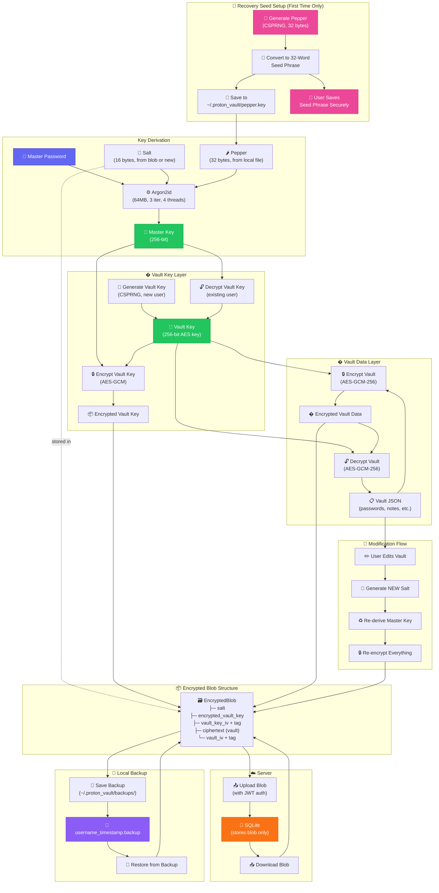

# Informe Técnico - Proton Vault

## 1. Descripción del Sistema y Arquitectura

Proton Vault es un Password Manager con enfoque zero-knowledge. El objetivo es que todo el contenido del vault (credenciales, passwords, notas) esté siempre en formato encrypted y que solo el cliente que conoce el master password pueda hacer decryption.

La arquitectura es Client-Server con clara separación de responsabilidades y de dominios de confianza:

- Backend: `backend/` implementado en Python con FastAPI. Expone una REST API con endpoints como `/auth/register`, `/auth/login`, `/vault`. Todos los payloads viajan en JSON. El backend se despliega junto con la database en un servidor separado del puesto del usuario.
- Frontend: `frontend/` implementado en Python con PySide6 (Qt). Es una GUI desktop que actúa como client HTTP del backend usando `api_client.py` y maneja el vault, sesiones y backups en `session_manager.py` y `backup_manager.py`. Todo el procesamiento criptográfico ocurre en el frontend.
- Módulos compartidos: `shared/` contiene la lógica criptográfica (`crypto.py`) y los data models (`models.py`) usados tanto por frontend como por backend, lo que evita divergencias de formato entre lo que el cliente cifra y lo que el servidor almacena.
- Database: el backend usa SQLite (`password_manager.db`) vía SQLAlchemy (`database.py`). Solo almacena blobs encrypted y metadata mínima de usuario. Desde la perspectiva de ciberseguridad, este componente se asume en un servidor aislado (por ejemplo, una zona distinta de red) que no tiene acceso a master passwords ni peppers.

Este diseño busca que un compromiso del servidor (backend + database) no implique compromiso directo del contenido del vault, porque ninguna de las claves necesarias para decryption vive en ese entorno. El único componente que conoce master password y pepper es el frontend local del usuario.

El flujo de datos es:

1. El usuario interactúa con el Frontend de PySide6 (`frontend/main.py`, `screens/auth_screen.py`, `screens/dashboard_screen.py`). Utiliza su usuario y contraseña para autenticarse, y usa la **contraseña maestra** para acceder a la bóveda. **No se puede recuperar esto si se olvida**.
2. El frontend deriva la master key, genera o usa el vault key y realiza encryption/decryption local usando `shared.crypto.CryptoManager` y los modelos `Vault` y `EncryptedBlob` de `shared.models`.
3. El resultado es un JSON blob encrypted (`EncryptedBlob.to_json()`), que viaja como string dentro de un JSON payload al backend por HTTP usando el API client.
4. El backend recibe ese blob en el endpoint `/vault` (`backend.main.update_vault`), y lo guarda literalmente como `Text` en la columna `encrypted_blob` de la tabla `users` en SQLite (`backend.database.User`). El backend nunca ve plaintext.
5. Cuando el usuario recupera el vault, el backend solo devuelve el mismo blob (`/vault` GET) y el frontend lo pasa de vuelta por `CryptoManager.decrypt_encrypted_blob` para reconstruir un objeto `Vault` en memoria.

Desde un punto de vista de ciberseguridad, el flujo asegura que:

- Los passwords nunca salen del entorno del cliente en plaintext.
- El servidor solo actúa como storage y punto de autenticación, de manera que un atacante con acceso al servidor observa únicamente blobs encrypted y hashes Argon2id.
- La separación física o lógica del servidor que almacena la database limita el impacto de un compromiso del endpoint del usuario: aunque el cliente esté comprometido, no hay una ruta directa desde el servidor hacia claves o peppers almacenados localmente.

Tecnologías concretas detectadas:

- Lenguaje: Python 3.10+
- Backend: FastAPI, SQLAlchemy, jose (JWT), Uvicorn.
- Frontend: PySide6 (Qt).
- Crypto: `argon2.low_level` (Argon2id), `cryptography.hazmat.primitives.ciphers` (AES-GCM), `secrets` y `os.urandom` como CSPRNG.

## 2. Implementación Criptográfica (Core)

Toda la parte crítica está en `shared/crypto.py` y `shared/models.py`.

### 2.1 Encryption con AES-256-GCM

Se usa explícitamente AES-GCM con 256-bit key. En `CryptoConfig`:

```python
class CryptoConfig:
    # Argon2id parameters (OWASP recommendations)
    argon2_memory_cost: int = 65536  # 64 MB
    argon2_time_cost: int = 3  # 3 iterations
    argon2_parallelism: int = 4  # 4 threads
    argon2_hash_len: int = 32  # 256-bit key

    # AES-GCM parameters
    aes_key_size: int = 32  # 256-bit key
    aes_iv_size: int = 12  # 96-bit IV (recommended for GCM)
    aes_tag_size: int = 16  # 128-bit authentication tag

    # Salt size
    salt_size: int = 16  # 128-bit salt
```

La función privada que hace la encryption es `_encrypt_aes_gcm`:

```python
def _encrypt_aes_gcm(
    self, key: bytes, plaintext: bytes, associated_data: bytes = b""
) -> Tuple[bytes, bytes, bytes]:
    # Generate random IV (nonce)
    iv = os.urandom(self.config.aes_iv_size)

    cipher = Cipher(algorithms.AES(key), modes.GCM(iv))
    encryptor = cipher.encryptor()

    if associated_data:
        encryptor.authenticate_additional_data(associated_data)

    ciphertext = encryptor.update(plaintext) + encryptor.finalize()

    return iv, ciphertext, encryptor.tag
```

Aquí se confirma:

- key de 32 bytes (256-bit) para AES.
- nonce/IV de 96 bits generado con `os.urandom`.
- Se usa modo `modes.GCM(iv)` con auth tag de 128 bits (`aes_tag_size = 16`).
- Se soporta `associated_data` para AAD (se usa literal `b"vault_key"` y `b"vault_data"` en las capas superiores).

La decryption simétrica está en `_decrypt_aes_gcm`:

```python
cipher = Cipher(algorithms.AES(key), modes.GCM(iv, auth_tag))
decryptor = cipher.decryptor()

if associated_data:
    decryptor.authenticate_additional_data(associated_data)

plaintext = decryptor.update(ciphertext) + decryptor.finalize()
```

El manejo del auth tag es el estándar de la librería `cryptography`: si el tag no calza, `finalize()` lanza `InvalidTag` y falla la operación completa (protección de integridad).

La encryption del vault en sí se hace en `encrypt_vault`:

```python
def encrypt_vault(self, vault: Vault, vault_key: bytes) -> Tuple[bytes, bytes, bytes]:
    plaintext = vault.to_json().encode("utf-8")
    return self._encrypt_aes_gcm(vault_key, plaintext, b"vault_data")
```

Y la encryption del vault key con la master key está en `encrypt_vault_key`:

```python
def encrypt_vault_key(
    self, vault_key: bytes, master_key: bytes
) -> Tuple[bytes, bytes, bytes]:
    return self._encrypt_aes_gcm(master_key, vault_key, b"vault_key")
```

Los resultados finales se empaquetan en un `EncryptedBlob` (base64 de `ciphertext`, `iv`, `auth_tag`, `salt`, `encrypted_vault_key`, etc.) y se serializan como JSON (`EncryptedBlob.to_json()`) antes de mandarlos al backend.

### 2.2 KDF con Argon2id

Para derivar la master key desde el master password se usa Argon2id con parámetros fijos. En `CryptoManager.derive_master_key`:

```python
def derive_master_key(self, password: str, salt: bytes) -> bytes:
    # Combine password with pepper for additional security
    password_with_pepper = password.encode("utf-8") + self._pepper

    derived_key = hash_secret_raw(
        secret=password_with_pepper,
        salt=salt,
        time_cost=self.config.argon2_time_cost,
        memory_cost=self.config.argon2_memory_cost,
        parallelism=self.config.argon2_parallelism,
        hash_len=self.config.argon2_hash_len,
        type=Type.ID,  # Argon2id
    )

    return derived_key
```

Parámetros efectivos (según `CryptoConfig`):

- `time_cost = 3`
- `memory_cost = 65536` (64 MB)
- `parallelism = 4`
- `hash_len = 32` (256-bit master key)
- `type = Type.ID` (Argon2id)

El salt viene de `generate_salt`:

```python
def generate_salt(self) -> bytes:
    return secrets.token_bytes(self.config.salt_size)
```

Y `salt_size = 16`, o sea 128-bit salt por derivación. En `create_encrypted_blob` se fuerza salt nuevo en cada modificación del vault:

```python
salt = self.generate_salt()
master_key = self.derive_master_key(password, salt)
```

Además, antes de pasar el password a Argon2id se concatena un pepper por usuario manejado por `PepperManager`. Ese pepper es 32 bytes (`PEPPER_SIZE = 32`) y se almacena localmente en `~/.proton_vault/pepper.key` en base64.

Para auth del backend (password de servidor) se usa otra derivación separada, también con Argon2id, tanto en `shared.crypto.hash_password_for_auth` como en `backend.auth.hash_auth_password`. En ambos casos se usa un `auth_pepper` constante:

```python
auth_pepper = b"ProtonVaultAuthPepper2024Secret!"
```

y los mismos parámetros de Argon2id (64MB, 3 iteraciones, parallelism=4, hash_len=32).

### 2.3 Randomness (CSPRNG)

Para randomness se usan solo fuentes CSPRNG del estándar de Python:

- `secrets.token_bytes()` en:
  - `PepperManager.generate_pepper` (32 bytes)
  - `CryptoManager.generate_salt` (16 bytes)
  - `CryptoManager.generate_vault_key` (32 bytes)
  - `backend.auth.generate_auth_salt` (16 bytes, luego base64)
- `os.urandom()` en `_encrypt_aes_gcm` para el nonce/IV de 12 bytes.

No hay RNG casero ni combinaciones raras. Todo está apoyado en `secrets` y `os.urandom`, que internamente son CSPRNG.

## 3. Justificación de Algoritmos, Librerías y Arquitectura desde Ciberseguridad

Librerías criptográficas importadas:

- `argon2.low_level.hash_secret_raw`, `argon2.low_level.Type`.
- `cryptography.hazmat.primitives.ciphers.Cipher`, `algorithms`, `modes`.
- `secrets` y `os` de la stdlib para randomness.

En el backend también se usa `jose.jwt` para JWT (HS256) para manejar sesiones de API.

Se escogen estas librerías porque implementan primitives estándar auditadas y ampliamente utilizadas. No se implementa AES, Argon2 ni RNG propios. Desde la perspectiva de ciberseguridad, esto reduce el riesgo de errores de implementación y se alinea con la recomendación de usar primitivas y librerías consolidadas en lugar de diseños ad-hoc.

Justificación específica:

- **Argon2id**: se usa como KDF para master password y como función de hashing para el server password. El objetivo es dificultar ataques offline contra las credenciales en caso de robo de la database en el servidor aislado. Los parámetros configurados (64MB de memoria, 3 iteraciones, parallelism 4) aumentan el costo por intento tanto en CPU como en memoria, lo que penaliza implementaciones en GPU/ASIC y hace menos eficiente un ataque de fuerza bruta masivo. El uso de salt por usuario (y en el caso del vault, salt por actualización) elimina la posibilidad práctica de Rainbow Tables reutilizables entre usuarios. El pepper adicional a nivel de cliente añade un secreto que no está presente en el servidor: un atacante que solo compromete el servidor no tiene ni master password ni pepper, incluso si conoce todos los parámetros de Argon2id.

- **AES-GCM (256-bit)**: se utiliza como esquema AEAD para el vault y para el vault key. Desde ciberseguridad, AES-GCM proporciona confidentiality y autenticidad del ciphertext con un esquema conocido y soportado por bibliotecas modernas. El auth tag detecta cualquier modificación del ciphertext, del IV o de la AAD, por lo que protege contra ataques de manipulación sobre el contenido almacenado en el servidor o en tránsito. El tamaño de key de 256 bits elimina preocupaciones prácticas sobre ataques de exhaustive key search.

- **Randomness con `secrets` y `os.urandom`**: la generación de salts, IVs, peppers y vault keys usa CSPRNG del sistema operativo. Esto evita riesgos asociados a RNG débiles o deterministas. Dado que el servidor está separado, el uso de CSPRNG en el cliente garantiza que los secrets generados para cifrar el vault no dependan de ningún estado compartido con el servidor.

Justificación de la arquitectura Client-Server y separación de servidores:

- El hecho de que el servidor que almacena la database esté en un entorno separado refuerza el modelo zero-knowledge. Un atacante que compromete ese servidor obtiene únicamente:
  - Hashes Argon2id de server passwords con salts individuales.
  - Blobs encrypted que no contienen plaintext ni keys.
- Todas las keys críticas (master_key derivada, vault_key en claro, pepper) residen en el cliente y solo en memoria o en almacenamiento local controlado por el usuario. Esto segmenta el riesgo: comprometer el servidor aislado y comprometer el endpoint del usuario son eventos distintos que deben ocurrir de forma combinada para romper la confidencialidad del vault.
- El uso de JWT en el backend simplifica el control de acceso a los endpoints. Desde un punto de vista de ciberseguridad, esto permite centralizar la lógica de autenticación en el servidor aislado sin mezclarla con la lógica de encryption, que permanece en el frontend.

## 4. Diagrama de Flujo de Datos (Texto descriptivo)

A continuación se describe el ciclo de vida de una contraseña nueva según el código actual.

1. **Input del usuario**

   - El usuario llena un formulario en la GUI (en `DashboardScreen`) con `title`, `username`, `password`, `url`, `notes`.
   - Esa info se convierte en un `VaultItem` (`VaultItem.create_new(...)`). El vault completo se maneja en memoria como `Vault` dentro de `SessionManager`.

2. **Generación de Key (Master Password + Salt -> KDF)**

   - Cuando se hace login o se guarda el vault, el frontend tiene el master password en memoria.
   - `PepperManager` se asegura de tener un pepper de 32 bytes (nuevo o recuperado) asociado al usuario local.
   - Se llama a `CryptoManager.create_encrypted_blob(vault, password, existing_vault_key)`.
   - Dentro de esa función:
     - Se genera un nuevo `salt = secrets.token_bytes(16)`.
     - Se deriva `master_key = derive_master_key(password, salt)` usando Argon2id con los parámetros descritos.

3. **Encryption (Plaintext + Key + Nonce -> Ciphertext + Tag)**

   - Se decide el `vault_key`: o se reutiliza (`existing_vault_key`) o se genera uno nuevo con `secrets.token_bytes(32)`.
   - Se serializa el vault a JSON: `plaintext = vault.to_json().encode("utf-8")`.
   - Se llama a:

     ```python
     vault_iv, vault_ciphertext, vault_tag = self.encrypt_vault(vault, vault_key)
     # que internamente llama a _encrypt_aes_gcm(vault_key, plaintext, b"vault_data")
     ```

   - En paralelo, se protege el vault_key con la master_key:

     ```python
     vk_iv, encrypted_vk, vk_tag = self.encrypt_vault_key(vault_key, master_key)
     # que internamente llama a _encrypt_aes_gcm(master_key, vault_key, b"vault_key")
     ```

   - Cada llamada genera su propio IV aleatorio de 12 bytes y su propio auth tag de 16 bytes.

4. **Envío al servidor (qué datos viajan por la red)**

   - Se construye un `EncryptedBlob`:

     ```python
     blob = EncryptedBlob(
         ciphertext=base64.b64encode(vault_ciphertext).decode("ascii"),
         iv=base64.b64encode(vault_iv).decode("ascii"),
         auth_tag=base64.b64encode(vault_tag).decode("ascii"),
         salt=base64.b64encode(salt).decode("ascii"),
         encrypted_vault_key=base64.b64encode(encrypted_vk).decode("ascii"),
         vault_key_iv=base64.b64encode(vk_iv).decode("ascii"),
         vault_key_auth_tag=base64.b64encode(vk_tag).decode("ascii"),
     )
     ```

   - Luego se hace `blob.to_json()` y ese string se manda al backend dentro de un JSON payload en el endpoint `/vault` (`BlobUpdate.encrypted_blob`).
   - Por la red viajan únicamente strings base64 y JSON; nunca viaja plaintext del vault.

5. **Almacenamiento (qué se guarda exactamente en la DB)**

   - En el backend, el endpoint `PUT /vault` hace:

     ```python
     current_user.encrypted_blob = blob_data.encrypted_blob
     current_user.updated_at = datetime.utcnow()
     db.commit()
     ```

   - O sea, guarda literalmente el JSON string producido por `EncryptedBlob.to_json()` en la columna `encrypted_blob` (tipo `Text`) de la tabla `users`.
   - El servidor no parsea ni toca los campos internos del blob para nada, solo los guarda y los devuelve.

El ciclo inverso (lectura del vault) simplemente hace GET `/vault`, el frontend recibe el JSON, lo convierte a `EncryptedBlob`, llama a `decrypt_encrypted_blob`, se vuelve a derivar la master_key con el salt guardado, se decripta el vault_key y después el vault completo.

## 5. Seguridad Práctica y Amenazas

### 5.1 Data at Rest

La protección principal de data at rest está en que la DB solo guarda blobs encrypted. En SQLite, cada fila de `users` contiene:

- `password_hash` Argon2id del server password.
- `auth_salt` para ese hash.
- `encrypted_blob` que es un JSON con:
  - `ciphertext` (vault encrypted con AES-256-GCM).
  - `iv` y `auth_tag` para el vault.
  - `salt` usado para derivar la master_key.
  - `encrypted_vault_key` con su `vault_key_iv` y `vault_key_auth_tag`.

Si un atacante obtiene el archivo `password_manager.db` en el servidor separado, sin master password ni pepper los blobs almacenados no son utilizables directamente. Para romper la confidencialidad del vault necesitaría:

- El master password correcto del usuario, que solo se introduce en el frontend.
- El pepper local del usuario (`~/.proton_vault/pepper.key`), que nunca se copia al servidor.

Este diseño implementa un modelo zero-knowledge centrado en el lado servidor: la base de datos aislada se considera comprometible sin que esto implique, por sí solo, exposición de passwords. Sin embargo, la protección en el endpoint del usuario es más limitada: el pepper está en disco local sin una capa adicional de encryption, almacenado en base64. Se intentan aplicar permisos 600, pero en sistemas como Windows esta protección es parcial. Desde ciberseguridad, esto significa que el servidor separado está razonablemente protegido frente a filtraciones de contenido del vault, pero el endpoint del usuario sigue siendo un punto crítico.

### 5.2 Data in Transit

En el código no hay ninguna referencia a HTTPS/TLS. Los ejemplos del README usan:

```bash
uvicorn backend.main:app --reload --port 8000
```

Eso levanta HTTP plano en `http://localhost:8000`. La seguridad en tránsito depende de:

- Uso local (loopback) en la misma máquina en el entorno de desarrollo.
- El hecho de que el vault siempre viaja encrypted (AES-GCM). Incluso si alguien intercepta el tráfico entre cliente y servidor separado, solo observa blobs base64 protegidos por AES-GCM.

No hay configuración explícita para certificados TLS ni reverse proxy en el repositorio. En un despliegue real con servidor aislado, sería necesario añadir HTTPS/TLS en el canal que une cliente y backend para proteger también metadatos, headers y evitar ataques de tipo MITM. En este proyecto se prioriza la protección criptográfica del contenido del vault; la protección de la capa de transporte se considera fuera de alcance y se deja explícitamente sin implementar.

### 5.3 Amenazas Mitigadas

- **Rainbow Tables / precomputed attacks**: El uso de salt aleatorio por usuario (y en el caso de la master_key, salt por vault update) rompe la viabilidad de Rainbow Tables. Incluso si alguien roba `salt` y `hash`, tiene que hacer brute force específico para ese salt. Para server auth se usa `auth_salt` independiente. Para master_key se usa otro salt base64 en el blob.

- **GPU cracking y fuerza bruta rápida**: Argon2id con 64MB y 3 iteraciones sube bastante el costo de cada intento de password. No es perfecto, pero es bastante mejor que un `PBKDF2` básico con pocos rounds.

- **Manipulación / bit-flipping del vault**: AES-GCM con auth tag evita modificaciones silenciosas. Si alguien cambia un bit del `ciphertext`, `iv`, `auth_tag` o de la AAD, la decryption lanza `InvalidTag` y la app no va a aceptar el vault como válido.

- **Robo del vault key aislado**: Incluso si alguien pudiera extraer `encrypted_vault_key` del blob, este también está protegido por AES-GCM con master_key como key y su propio IV y tag. No basta con tener solo ese pedazo.

Lo que no se cubre totalmente (limitaciones):

- No hay protección fuerte contra keylogging en el OS o malware en el cliente.
- El pepper está en disco sin hardware-backed key store.
- No hay "device binding" ni nada de eso.

## 6. Resultados y Limitaciones

### 6.1 Qué funciona bien

- **Encryption/Decryption**: La ruta completa de encrypt/decrypt funciona y está bien separada. `CryptoManager` tiene funciones limpias para derivar master_key, generar vault_key, encryptar y decryptar tanto el vault como el vault_key. El uso de base64 y `EncryptedBlob` hace que el backend solo sea un storage tonto.

- **Persistencia de datos**: SQLite con SQLAlchemy es simple pero suficiente. `encrypted_blob` se guarda y se recupera sin problemas. Además, existe `backup_manager.py` para manejar backups locales encrypted, lo que da una capa extra de resiliencia.

- **Arquitectura zero-knowledge**: El backend literalmente nunca ve plaintext. El contrato está claro en los docstrings: "The server cannot decrypt this data".

- **Uso de librerías estándar**: Toda la crypto sensible está delegada en `cryptography` y `argon2`, que es exactamente lo que uno quiere en un proyecto de curso.

### 6.2 Qué falta o podría mejorar

- **HTTPS/TLS real**: No hay configuración de HTTPS en el código. Para un entorno donde el servidor con la database esté separado, esto es una carencia relevante: la capa de transporte debería cifrarse para proteger también metadatos y para evitar MITM entre cliente y servidor.

- **Manejo de sessions**: El backend usa JWT HS256 con `SECRET_KEY` que por defecto se genera en runtime con `secrets.token_hex(32)` si no hay env var. Esto implica que un reinicio del backend invalida todos los tokens previos si la variable `PM_SECRET_KEY` no está fijada. Para un entorno de producción sería preferible gestionar el secret de forma estable y centralizada.

- **Pepper storage**: El pepper se guarda en `~/.proton_vault/pepper.key` en base64 y sin encryption adicional. Se intenta restringir permisos, pero en algunos sistemas operativos esto no ofrece garantías fuertes. Una mejora razonable sería usar un OS keyring o un hardware-backed keystore cuando esté disponible.

- **Rotación de keys**: Se rota el salt del KDF en cada modificación del vault, pero no existe un mecanismo explícito de rotación periódica del vault_key. Incluir una operación de re-encryption completa con un vault_key nuevo permitiría limitar el impacto de una posible exposición de claves.

- **Hardcoded peppers para auth**: Para auth de backend se usa un `auth_pepper` hardcoded. En un sistema real este valor debería gestionarse como secret externo (por ejemplo, variable de entorno o secret manager) y no como literal en el código fuente.

- **Device Binding y 2FA**: Para permitir acceder a las contraseñas únicamente de dispositivos en los que se confía, añadiendo una barrera de seguridad física.

En conjunto, el núcleo criptográfico y la arquitectura zero-knowledge centrada en el servidor separado están alineados con buenas prácticas de ciberseguridad para un proyecto académico. Las principales brechas están en la ausencia de TLS, en la gestión de secrets (peppers y JWT secret) y en la falta de mecanismos más avanzados de gestión de keys y de hardening del endpoint del usuario.


## 7. Anexos

### 7.1 Overview Diagram



### 7.2 Cryptographic Specifications

| Component | Algorithm | Parameters |
|-----------|-----------|------------|
| Key Derivation | Argon2id | memory=65536KB, time=3, parallelism=4, hash_len=32 |
| Vault Encryption | AES-256-GCM | 96-bit IV (nonce), 128-bit auth tag |
| Vault Key Encryption | AES-256-GCM | 96-bit IV (nonce), 128-bit auth tag |
| Salt | CSPRNG | 16 bytes, **regenerated on every vault modification** |
| Pepper (Recovery Seed) | CSPRNG + BIP39-style | 32 bytes, stored locally as 32-word seed phrase |
| Vault Key | CSPRNG | 32 bytes (256-bit), encrypted with Master Key |
| Server Auth | Argon2id + JWT | Separate from encryption, 24h token expiry |

### 7.3 Data Flow Summary

Encryption (Save Vault)
```
Master Password + Salt + Pepper
        │
        ▼ Argon2id
    Master Key (256-bit)
        │
        ├──► Encrypt Vault Key ──► Encrypted Vault Key
        │
        ▼
    Vault Key (256-bit)
        │
        ▼ AES-GCM
    Encrypted Vault Data
        │
        ▼
    EncryptedBlob { salt, encrypted_vault_key, ciphertext, IVs, tags }
        │
        ├──► Server (SQLite)
        └──► Local Backup (~/.proton_vault/backups/)
```

Decryption
```
    EncryptedBlob (from Server or Backup)
        │
        ├──► Extract Salt
        │
        ▼
Master Password + Salt + Pepper (from local file)
        │
        ▼ Argon2id
    Master Key (256-bit)
        │
        ▼ AES-GCM Decrypt
    Vault Key (256-bit)
        │
        ▼ AES-GCM Decrypt
    Plain Vault JSON
```

### 7.4 Pepper (Recovery Seed) System

The pepper is a **user-specific recovery seed** similar to cryptocurrency wallets:

1. **Generation**: On first registration, a 32-byte random pepper is generated using CSPRNG
2. **Seed Phrase**: The pepper is converted to a 32-word human-readable phrase (BIP39-style wordlist)
3. **User Responsibility**: The user MUST save this seed phrase - it cannot be recovered
4. **Local Storage**: The pepper is saved to `~/.proton_vault/pepper.key` (base64 encoded)
5. **Recovery**: If the pepper file is lost, users can enter their 32-word seed phrase to recover

#### Why This Matters
- Without the pepper, **passwords cannot be decrypted** even with the correct master password
- This provides an additional layer of security beyond just the master password
- Similar to a cryptocurrency wallet, losing the seed phrase means losing access forever

### 7.5 Security Properties

1. **Zero-Knowledge Server**: Server only stores encrypted blobs; has no ability to decrypt user data
2. **Forward Secrecy**: New salt generated on every modification - old encrypted data cannot be replayed
3. **Authenticated Encryption**: AES-GCM provides both confidentiality and integrity verification
4. **Memory-Hard KDF**: Argon2id (64MB) resists GPU/ASIC brute-force attacks
5. **Two-Factor Encryption**: Requires both Master Password AND Pepper to decrypt
6. **Local Backup**: Users can restore data even if server is compromised or unavailable
7. **Key Separation**: Server auth password is separate from vault encryption password
